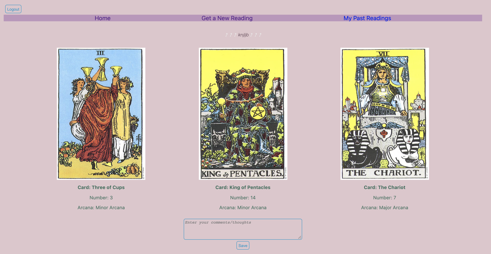

# One Question A Day
-------------------------------------------------------
# [Click to view the app](https://unit2summer.herokuapp.com/)
-------------------------------------------------------
# Motivation: 
  I am a tarot reader/life reader, and I have psychic abilities. Tarot cards is the first tool I learned to use, and I think it's a great starting point for people who are interested in reading or spirituality in general. 

  There are so many tarot card decks on the market today. Generally, a spiritual teacher would design a deck of card with a theme, and he/she would hire an visual artist to render the cards. A deck can have 44, 52, or 90 cards, for example; that is totally up to the designer.

  The Rider-Waite Tarot Deck is the most classical deck, since it encompasses all elements that a reading needs to take into consideration, and its usage is very versatile. For example, I can use a card to answer a yes or no question, and I can help my clients to find his/her cat. 

-------------------------------------------------------
# Decription: 
- In this App, the user will think about a question, either a binary question or an open-ended question, or a general concern, and type it in the text box. 
- After the user clicks on the "Shuffle" button, he/she will get three cards along with the name of the card, the number of the card, and the type of Arcana. 
- Then, the user will think about what messages the three cards may be trying to convey, or how he/she feels after seeing the three cards, and write comments in the comments section, and click "Save".
- In the "My Past Readings" section, the user can go in, click on his/her past readings, and edit or delete the reading. 
- Essentially, the user can use the app as a Reading Diary. 

-------------------------------------------------------

# Technologies Used: 
- JS, HTML, CSS, MongoDB, Express, Node

-------------------------------------------------------
 # Screenshots:

-------------------------------------------------------
# Directories Worth Mentioning:

- Routes: 
  - Five js files
  
- Models:
  - Four models: User, Profile, Card, Reading, 
  - CardSchema has name, number, and img as properties
  - ReadingSchema has user referencing the Profile model, card1, card2, card3, and comment as properties. 

- Controllers:
  - Four js files: cards.js, myProfile.js, newReading.js, pastReading.js

- Views:
  - Essentially has an ejs file  for each route's endpoint page.

- Database:
  - a JSON file that contains data about the 78 cards.
  - The JSON file is parsed in one of the controllers/controller function files.
  
- Images:
  - Images of the 78 cards are stored in public/images/cards
  

-------------------------------------------------------
# Future Improvements:
- A page with all 78 cards with descriptions and interpretations.
- Have a function that will allow inverted cards to show, as meanings of inverted cards are different. 
- Clean up directories and codes to make them more organized and coherent. 
- Name files/variables more efficiently. 
  
